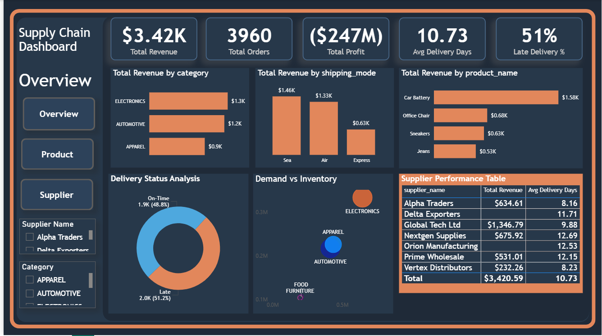

# 📦 Supply Chain Analysis Dashboard

## 📌 Project Overview
This project presents an end-to-end **Supply Chain Analysis Dashboard** built using **Python, SQL & Power BI** to uncover key business insights across revenue, orders, delivery performance, and supplier efficiency.

The dashboard enables stakeholders to monitor supply chain performance, identify bottlenecks, and make data-driven decisions to improve operational efficiency and profitability.

---

## 🎯 Business Objective
The primary goal of this project is to:
- Analyze **sales & revenue performance**
- Track **delivery efficiency and delays**
- Evaluate **supplier performance**
- Identify **high-demand products and categories**
- Optimize **inventory vs demand planning**

---

## 🛠️ Tech Stack 
- **Python** → Data Cleaning & Analysis
- **SQL** → Data extraction & transformation  
- **Power BI** → Data visualization & dashboarding  
- **Excel/CSV** → Dataset

---

## 📊 Key KPIs
- 💰 **Total Revenue:** $3.42K  
- 📦 **Total Orders:** 3960  
- 📉 **Total Profit:** -$247M  
- 🚚 **Avg Delivery Days:** 10.73  
- ⏱️ **Late Delivery %:** 51%  

---

## 📈 Dashboard Insights

### 🔹 Revenue Analysis
- Electronics generates the highest revenue (~$1.3K)
- Automotive and Apparel follow as key contributors

### 🔹 Shipping Performance
- Sea shipping contributes highest revenue
- Air is slightly lower but faster
- Express has least contribution

### 🔹 Product Insights
- Top-performing product: **Car Battery**
- Followed by Office Chairs & Sneakers

### 🔹 Delivery Performance
- Late deliveries (51%) exceed on-time deliveries
- Indicates major logistics inefficiencies

### 🔹 Demand vs Inventory
- Electronics has highest demand
- Some categories show imbalance → scope for inventory optimization

### 🔹 Supplier Performance
- **Global Tech Ltd** generates highest revenue
- Suppliers like **Nextgen Supplies** show higher delivery delays
- Opportunity for supplier optimization

---

## 🖼️ Dashboard Preview

---

## 🔍 Key Business Problems Solved
- Why are delivery delays high?
- Which suppliers are underperforming?
- Which products generate maximum revenue?
- How does shipping mode impact performance?
- Where is demand vs inventory mismatch?

---

## 💡 Recommendations
- Improve logistics for reducing **late deliveries (51%)**
- Optimize supplier selection based on delivery performance
- Increase focus on high-revenue products (Electronics)
- Balance inventory with demand forecasting
- Reduce dependency on slower shipping modes

---

## 📌 Future Improvements
- Add **predictive analytics (forecasting)**
- Integrate **real-time data pipeline**
- Build **SQL database backend**
- Add **advanced DAX measures**
- Deploy dashboard to Power BI Service  

---

## 🙋‍♂️ Author
**Rahul Mittapelli**  
- Aspiring Data Analyst  
- Skilled in Python, SQL, Power BI & Data Analytics  
